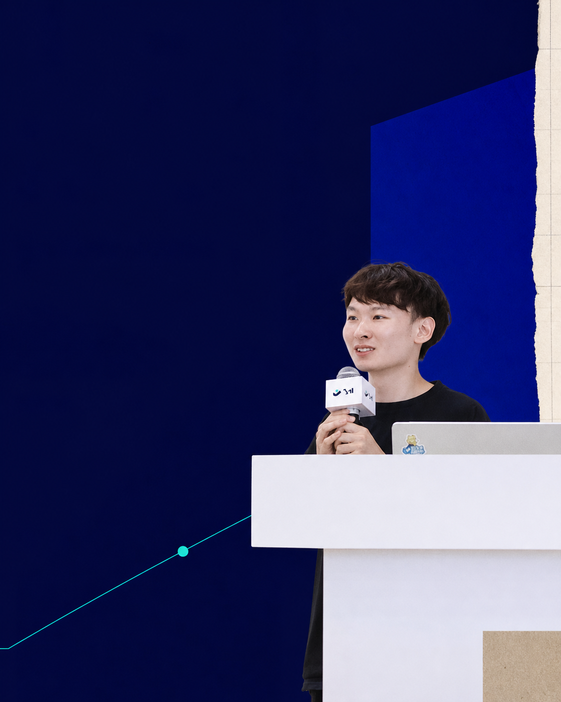
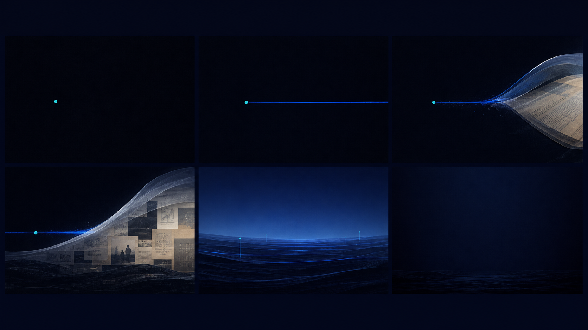
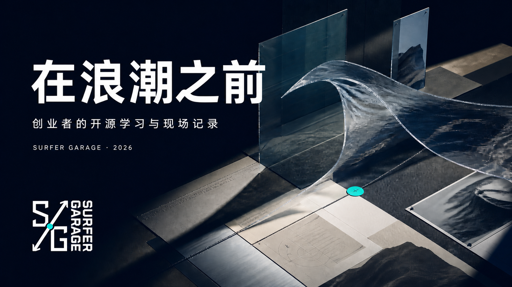
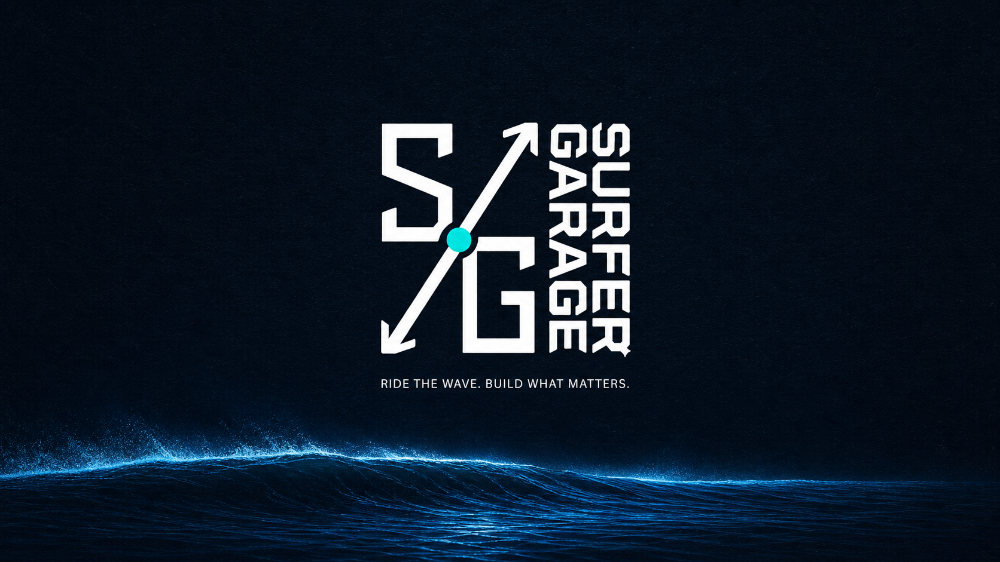

# Asset Catalog · 视觉资产索引

## A01 · Launch Key Visual

- 文件：[`assets/generated/launch-key-16x9.png`](./assets/generated/launch-key-16x9.png)
- 用途：品牌发布、栏目上线、B 站 / YouTube 封面、发布片主镜头
- 核心识别：实体化透明浪面、真实纸张证据、单一 Cyan 航标、左侧大留白
- 规则：标题进入左侧暗场；正式 Logo 只在成片阶段放入左下安全区

## A02 · Founder Field Cover

- 文件：[`assets/generated/founder-cover-4x5.png`](./assets/generated/founder-cover-4x5.png)
- 用途：Surfing Founder、人物采访、小红书 / 视频号封面
- 核心识别：保留真实人物与现场证据，以电蓝建筑面和 Cyan 轨迹建立品牌层
- 规则：不磨皮、不替换人物、不伪造场景；姓名与期数进入左上留白

## A03 · Insight Object

- 文件：[`assets/generated/insight-object-1x1.png`](./assets/generated/insight-object-1x1.png)
- 用途：数据洞察、方法论、报告封面、金句轮播首图
- 核心识别：把抽象变化做成可被拍摄的物理证据，而不是发光数据墙
- 规则：一张图只解释一个数字或一个判断；标题进入左上暗场

## A04 · 15s Brand Ident Storyboard

- 文件：[`assets/generated/brand-ident-storyboard-16x9.png`](./assets/generated/brand-ident-storyboard-16x9.png)
- 用途：15 秒品牌片、片头、栏目发布动画的视觉基准
- 叙事：节点出现 → 信号发出 → 推动浪面 → 资料被显影 → 海面稳定 → 正式 Logo 片尾
- 规则：前五镜不放 Logo；最后一镜只使用正式 Logo 文件，不让模型生成标志

## A05 · Launch Title Frame

- 文件：[`assets/generated/launch-title-frame-16x9.png`](./assets/generated/launch-title-frame-16x9.png)
- 用途：发布片首帧、官网主视觉、发布文章首图
- 内容：`在浪潮之前 / 创业者的开源学习与现场记录`
- 状态：艺术方向与排版样稿；正式导出前应以源文件重新放置 Logo，保证像素级准确

## A06 · Brand End Card

- 文件：[`assets/generated/brand-end-card-16x9.png`](./assets/generated/brand-end-card-16x9.png)
- 用途：品牌片、教程片与人物片统一片尾
- 建议时长：2.5–3 秒；前 8–12 帧保留声音留白，再进入 Logo sting
- 状态：成片方向样稿；Logo 在制作工程中仍应替换为正式文件

## A07 · LIVE Gathering

- 文件：[`assets/generated/live-gathering-9x16.png`](./assets/generated/live-gathering-9x16.png)
- 用途：活动发布、线下招募、视频号 / 小红书竖屏首帧
- 核心识别：真实小型讨论现场、暖色生活光、穿过现场的深蓝布浪
- 规则：上方留白放时间与地点；不使用“精英握手”式图库语义

## A08 · YOUTH Field Notes

- 文件：[`assets/generated/youth-field-notes-16x9.png`](./assets/generated/youth-field-notes-16x9.png)
- 用途：Startup Playbook、教程、开源资料与方法论发布
- 核心识别：桌面证据、手写过程、真实工具和一张穿过材料的蓝色描图纸
- 规则：正式教程用真实界面替换画面中的概念屏幕；标题进入右侧 Paper 留白

## A09 · MEDIA Dialogue

- 文件：[`assets/generated/media-dialogue-16x9.png`](./assets/generated/media-dialogue-16x9.png)
- 用途：浪前对话、双人访谈、播客视频封面和章节卡
- 核心识别：人物分置两侧，中间的实体波面负责连接观点而不是承载装饰
- 规则：这是构图样稿；人物成片必须回到原始视频帧，不能用生成图代替身份事实

## 正式资产与生成资产的边界

| 内容 | 来源 | 是否允许生成 |
|---|---|---|
| Logo / 字标 | 正式品牌文件 | 否 |
| 人物身份与真实界面 | 原始照片 / 录屏 | 否 |
| 环境延展、材质、概念隐喻 | 生成母视觉 | 是 |
| 标题、字幕、日期、CTA | 设计排版层 | 否，不烘焙进生成背景 |

这样做不是把画面重新“代码拼起来”，而是把成片拆成两个有明确责任的层：图像生成负责艺术方向和场景，正式品牌层负责准确性与可维护性。
