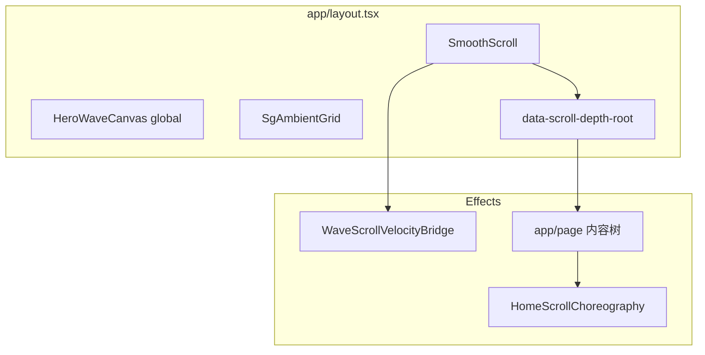

# 07. 动画编排与统筹（全局）

> **单一入口**：动效「手感数字 / 选择器 / ST id」以 **`lib/sg-motion-system.ts`** 为准；**原语**在 **`components/motion/sg-motion-primitives.ts`**；**首页注册顺序**在 **`components/motion/sg-home-registry.ts`**；React 挂载点为 **`components/home-scroll-choreography.tsx`**。本文件描述 **与 Lenis / CSS 变量 / WebGL 如何分工**。  
> **配套**：`wiki/01`（生命周期）、`wiki/02`（禁止项与观感）、`wiki/03`（性能）、`wiki/04`（排障）、`wiki/05`（区块方案）。

---

## 1. 目标与边界

- **目标**：整页滚动有一条清晰「水压」：**L0 深度与浪面收束 → L1 Manifesto/Hero → L2 区块揭幕 → L3 桌面叠卡 pin + 收尾序列**；同屏少打架、少粘滞。
- **边界**：首页 **`HomeScrollChoreography`** 通过 **`gsap.context`** 托管大部分 ScrollTrigger；**组件内 ST 例外**见 §6。
- **硬约束**：正文区禁止滚动 **opacity/autoAlpha** 直 scrub（见 `02`）；**`prefers-reduced-motion: reduce`** 下不注册 Lenis 与编排内 ST，并固定 **`--depth-t: 0`**。

---

## 2. 运行时装载顺序（简图）

- **父先子后**：`SmoothScroll` 的 `useEffect`（Lenis + **`scrollerProxy(document.documentElement)`**）在子树 **`useLayoutEffect`** 之后执行；首次 **`ScrollTrigger.refresh()`** 以 Lenis 就绪后的那次为准（见 `01` → Lenis 与 ST）。
- **数据旁路**：**`WaveScrollVelocityBridge`** 在 Lenis `scroll` 上写 **`:root --wave-scroll-vel`**，供 Hero / `WaterVolumeFx` 读；与 **`--depth-t`** 独立。

---

## 3. 语义分层 L0–L3 与物理模块

| 层 | 含义 | 主要实现 | `SG_SCRUB` 键（节选） |
|---|------|-----------|------------------------|
| **L0** | 整页下潜、浪面在进 `#proof` 前的收束 | `register-global-depth-scrub`、`register-hero-choreography`（`hero-wave-calm`） | `globalDepth`、`heroWaveCalm` |
| **L1** | Manifesto 字标 scrub、Hero 段落 scrub、**字符级字标 stagger**（load）、首屏 **`data-hero-reveal`** 入场 | `register-manifesto-scroll`、`register-hero-wordmark-stagger`、`register-hero-choreography` | `manifestoWordmark`、`manifestoFade`、`heroParagraph` |
| **L1.5** | 桌面 cursor-aware **magnet hover**（CTA / 带 `data-magnet` 元素） | `register-magnet-hover` | — |
| **L2** | 片场 intro / 呼吸 glow、GitHub 卡、触点揭幕、Call / **Fit** 揭示、**Footer 字标 scroll reveal** | `register-founders-intro`、`register-founder-breath`、`register-github-repo-cards`、`register-social-expand`、`register-call-reveal`、`register-fit-reveal`（`< md`）、`register-footer-wordmark-reveal` | `socialExpand`、`footerWordmark` |
| **L3** | 桌面 **pin + scale**（Manifesto 侧栏 + 四屏片场叠卡 + **Fit 收尾 pin**） | **`matchMedia(SG_MEDIA_MD_MIN)`** 内 `register-desktop-pins`、`register-fit-closing-pin` | `founderPin`、`fitPin` |

**scrub 手感**：`socialExpand` 数值 **大于** `globalDepth` / Hero / Manifesto，使 Connect 揭幕更「大幕」；**`founderPin` / `fitPin` 较紧**，减轻叠卡 / 收尾粘滞。

---

## 4. `gsap.context` 内注册顺序

**文件**：`components/motion/sg-home-registry.ts`。

### 4.1 全端（`registerHomeScrollMotion`，`reduced` 为假）

| 顺序 | 函数 | 典型 `ScrollTrigger.id` / 说明 |
|------|------|----------------------------------|
| 1 | `registerGlobalDepthScrub` | `global-depth-t` → `:root --depth-t` |
| 2 | `registerManifestoScroll` | `manifesto-wordmark`、`manifesto-fade-depth` |
| 3 | `registerHeroWordmarkStagger` | 无 ST（load 一次性字符 stagger） |
| 4 | `registerHeroChoreography` | `manifesto-scrub`、`hero-wave-calm`（触发 **`#founders`**） |
| 5 | `registerFoundersIntro` | `founders-intro` |
| 6 | `registerFounderBreath` | `founder-breath-*` |
| 7 | `registerGithubRepoCards` | `github-repo-card-*` |
| 8 | `registerSocialExpand` | `social-expand` |
| 9 | `registerCallReveal` | `call-reveal` |
| 10 | `registerFooterWordmarkReveal` | `footer-wordmark`（巨型 **SURFERGARAGE** 字符 scrub） |

### 4.2 移动端（`registerHomeMobileMotion`，`< md`）

| 函数 | 说明 |
|------|------|
| `registerFitReveal` | `#fit` toggle 揭示（桌面由 pin 接管，避免双注册） |

### 4.3 桌面（`registerHomeDesktopMotion`，`md+`）

| 函数 | 典型 `ScrollTrigger.id` |
|------|-------------------------|
| `registerDesktopPins` | `manifesto-pin`、`founder-stack-0…3` |
| `registerFitClosingPin` | `fit-closing-pin`（`#fit` 一屏 pin + 清单 stagger） |
| `registerMagnetHover` | 无 ST |

**主列区块顺序**：`#manifesto` → `#proof` → `#founders` → `#social` → `#call` → `#fit` → **`SiteFooter`**（含 footer wordmark）。

**Pin 起点**：片场与 Fit pin 均使用 **`start: "top 72px"`**（sticky header 高度；GSAP **不识别 rem**，须写 px）。

---

## 5. Lenis ↔ ScrollTrigger ↔ CSS 变量

| 变量 | 写入方 | 读取方 |
|------|--------|--------|
| `--depth-t` | `register-global-depth-scrub`（**`formatSafeDepthProgress`**） | `globals.css`（`--sg-dt`、`sg-main-depth`、`--surface-mode`、`--ambient-mode`）、`UnderwaterLightStage`、`WaterVolumeFx`、`hero-wave-canvas` |
| `--wave-scroll-vel` | `WaveScrollVelocityBridge` | Hero Shader、`WaterVolumeFx` |
| `--wave-distortion` 等 | `register-hero-choreography` scrub 到 `data-hero-wave` | Hero Shader |

**顶栏锚点跳转**：`site-header.tsx` 使用 **`lenis.scrollTo({ immediate: true })`**，不做 smooth 缓停。

---

## 6. 组件内 ScrollTrigger（不在 `HomeScrollChoreography` 的 `ctx` 内）

**（当前）** 无长期 ST 写在子组件内。B 站 iframe 懒加载由 **`IntersectionObserver`** 驱动，非 ST。

若未来在子组件新增长期 ST：须 **`ScrollTrigger.create({ id: "…" })`** 并在 cleanup / **`gsap.context`** 中 **`kill`**。

---

## 7. RAF / WebGL / CSS 氛围（与 GSAP 并行）

- **Lenis**：挂在 **GSAP ticker** 上 `lenis.raf`（`smooth-scroll.tsx`）。
- **Hero**：R3F 独立 RAF；视口外 **`frameloop="never"`**（见 `03`）。
- **首页第二路 WebGL**：`WaterVolumeFx`（读 `--depth-t` / `--wave-scroll-vel`）。
- **Blueprint 氛围**：`SgAmbientGrid`（点阵 + grain），出水线后随 **`--surface-mode`** 显形；`GlowRiver` 含 **`sg-river-deep`** 全页 subtle 纹理。

---

## 8. 新增或改动动效时的检查清单

1. **分层**：属于 L0–L3 哪一层？scrub 是否应比邻层更紧 / 更松？优先只改 **`sg-motion-system.ts`**。
2. **注册**：能否放进 **`sg-home-registry.ts`**？移动端 / 桌面是否需 **`matchMedia` 分流**（如 Fit）？
3. **正文**：是否违反 **`02` 禁止项**（尤其正文 **opacity**）？
4. **Pin 单位**：`start` / `end` 是否只用 **px / % / vh**（不用 rem）？
5. **降级**：**`prefers-reduced-motion`** 是否与 Lenis、编排、WebGL 挂载一致？
6. **调试**：**`NEXT_PUBLIC_GSAP_DEBUG=1`** 下核对 **`id`** 不与 §4 表冲突。

---

## 9. 修订记录

| 日期 | 摘要 |
|------|------|
| 2026-05-11 | 首版：L0–L3 映射、`home-scroll-choreography` 注册表、Lenis/CSS/WebGL 分工、新增检查清单。 |
| 2026-05-26 | **V2.0 视觉成熟化**：增补 `#proof` 出水线、`hero-wordmark-stagger`、`fit-closing-pin` / `fit-reveal`、`footer-wordmark`、`magnet-hover`；L1.5 层；`SgAmbientGrid`；顶栏 instant scroll；片场四屏（微信 / 视频 / Playbook / Visual）；`SG_MEDIA_MD_MAX` 移动端 Fit 分流。 |
