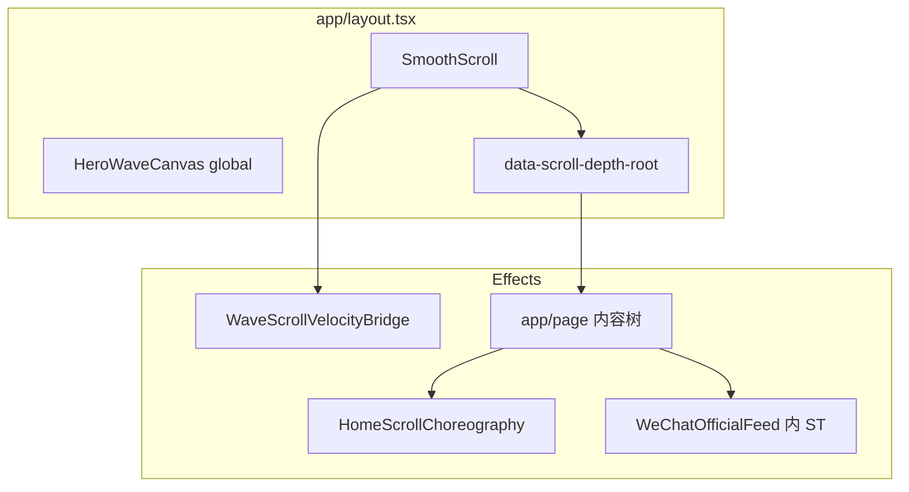

# 07. 动画编排与统筹（全局）

> **单一入口**：动效「手感数字」以 **`lib/sg-motion-system.ts`** 为准；本文件描述 **谁在何时注册**、**与 Lenis / CSS 变量 / WebGL 如何分工**，避免再叠一套平行叙事。  
> **配套**：`wiki/01`（生命周期）、`wiki/02`（禁止项与观感）、`wiki/03`（性能）、`wiki/04`（排障）、`wiki/05`（第六轮区块方案）。

---

## 1. 目标与边界

- **目标**：整页滚动有一条清晰「水压」：**L0 深度与浪面收束 → L1 Manifesto/Hero → L2 区块揭幕 → L3 桌面叠卡 pin**；同屏少打架、少粘滞。
- **边界**：首页 **`HomeScrollChoreography`** 通过 **`gsap.context`** 托管大部分 ScrollTrigger；**例外**见 §6「组件内 ST」。
- **硬约束**：正文区禁止滚动 **opacity/autoAlpha** 直 scrub（见 `02`）；**`prefers-reduced-motion: reduce`** 下不注册 Lenis 与编排内 ST，并固定 **`--depth-t: 0`**（见 `home-scroll-choreography.tsx`）。

---

## 2. 运行时装载顺序（简图）

- **父先子后**：`SmoothScroll` 的 `useEffect`（Lenis + **`scrollerProxy(document.documentElement)`**）在子树 **`useLayoutEffect`** 之后执行；首次 **`ScrollTrigger.refresh()`** 以 Lenis 就绪后的那次为准（见 `01` → Lenis 与 ST）。
- **数据旁路**：**`WaveScrollVelocityBridge`** 在 Lenis `scroll` 上写 **`:root --wave-scroll-vel`**，供 Hero / `WaterVolumeFx` 读；与 **`--depth-t`** 独立。

---

## 3. 语义分层 L0–L3 与物理模块

| 层 | 含义 | 主要实现 | `SG_SCRUB` 键（节选） |
|---|------|-----------|------------------------|
| **L0** | 整页下潜、浪面在进触点前的收束 | `register-global-depth-scrub`、`register-hero-choreography`（`hero-wave-calm`） | `globalDepth`、`heroWaveCalm` |
| **L1** | Manifesto 字标/淡入 scrub、Hero 段落 scrub、首屏 **load** 入场（**`data-hero-reveal`** 的 **`gsap.from`**，无 ScrollTrigger） | `register-manifesto-scroll`、`register-hero-choreography` | `manifestoWordmark`、`manifestoFade`、`heroParagraph` |
| **L2** | 片场 intro / 呼吸 glow、GitHub 卡、触点揭幕、Call 揭示 | `register-founders-intro`、`register-founder-breath`、`register-github-repo-cards`、`register-social-expand`、`register-call-reveal` | `socialExpand`（最重）、其余多为 `SG_REVEAL` 时长 |
| **L3** | 桌面 **pin + scale**（Manifesto 侧栏 + 五屏叠卡） | **`matchMedia('(min-width: 768px)')`** 内 `register-desktop-pins` | `founderPin` |

**scrub 手感**：`socialExpand` 数值 **大于** `globalDepth` / Hero / Manifesto，使 Connect 揭幕更「大幕」、更跟手慢半拍；**`founderPin` 较紧**，减轻叠卡粘滞（见 `sg-motion-system.ts` 顶部注释）。

---

## 4. `gsap.context` 内注册顺序（与 DOM 区块顺序不必一致）

**文件**：`components/home-scroll-choreography.tsx`（`reduced` 为假时）。

| 顺序 | 函数 | 典型 `ScrollTrigger.id` / 说明 |
|------|------|----------------------------------|
| 1 | `registerGlobalDepthScrub` | `global-depth-t` → `:root --depth-t` |
| 2 | `registerManifestoScroll` | `manifesto-wordmark`、`manifesto-fade-depth` |
| 3 | `registerHeroChoreography` | `manifesto-scrub`、`hero-wave-calm`（触发 **`#social`**） |
| 4 | `registerFoundersIntro` | `founders-intro` |
| 5 | `registerFounderBreath` | `founder-breath-*` |
| 6 | `registerGithubRepoCards` | `github-repo-card-*` |
| 7 | `registerSocialExpand` | `social-expand` |
| 8 | `registerCallReveal` | `call-reveal` |

**随后**（**同一 `useLayoutEffect` 外**）：**`gsap.matchMedia('(min-width: 768px)')`** → **`registerDesktopPins`** → `manifesto-pin`、`founder-stack-0`…`4`。

**说明**：片场相关 ST 先于 **`#social`** 的 `social-expand` 注册，来自历史调参（呼吸带 / GitHub 与 intro 的衔接）；**调整顺序须全页 markers 回归**，勿假定「DOM 从上往下 = 注册顺序」。

---

## 5. Lenis ↔ ScrollTrigger ↔ CSS 变量

| 变量 | 写入方 | 读取方 |
|------|--------|--------|
| `--depth-t` | `register-global-depth-scrub`（**`formatSafeDepthProgress`**） | `globals.css`（`--sg-dt`、`sg-main-depth`）、`UnderwaterLightStage`、`WaterVolumeFx`、`hero-wave-canvas` |
| `--wave-scroll-vel` | `WaveScrollVelocityBridge` | Hero Shader、`WaterVolumeFx` |
| `--wave-distortion` 等 | `register-hero-choreography` scrub 到 `data-hero-wave` | Hero Shader |

**刷新**：`SmoothScroll`（resize、首启）、`HomeScrollChoreography`（挂载末、resize 防抖、`document.fonts.ready`）均会 **`ScrollTrigger.refresh()`**；属 **有意冗余**，优先正确性（见 `01`）。

---

## 6. 组件内 ScrollTrigger（不在 `HomeScrollChoreography` 的 `ctx` 内）

| 位置 | `id` | 说明 |
|------|------|------|
| `components/wechat-official-feed.tsx` | **`wechat-feed-scrub-sync`** | 与 **`register-desktop-pins`** 中公众号叠卡 **`end: FOUNDER_WECHAT_PIN_END`** 对齐；横滑进度经 **`mapWechatPinProgressToHorizontalScrub`** |

卸载由 **组件 `useEffect` cleanup** 负责；**`SmoothScroll` teardown** 时 **`ScrollTrigger.getAll().forEach(kill)`** 也会清掉。新增「第四类」长期 ST 时须对照 **`01` → Lenis 与 ScrollTrigger 生命周期**。

---

## 7. RAF / WebGL / CSS 氛围（与 GSAP 并行）

- **Lenis**：挂在 **GSAP ticker** 上 `lenis.raf`（`smooth-scroll.tsx`）。
- **Hero**：R3F 独立 RAF；视口外 **`frameloop="never"`**（见 `03`）。
- **首页第二路 WebGL**：`WaterVolumeFx`（读 `--depth-t` / `--wave-scroll-vel`）；与 **`.uwl-*` CSS** 同属氛围层，**勿再叠第三套全页噪声动效**（见 `01` / `03`）。

---

## 8. 新增或改动动效时的检查清单

1. **分层**：属于 L0–L3 哪一层？scrub 是否应比邻层更紧 / 更松？优先只改 **`sg-motion-system.ts`**。
2. **注册**：能否放进 **`HomeScrollChoreography` 的 `gsap.context`**？若必须写在子组件，文档化 **`id`** 与 **kill** 路径。
3. **正文**：是否违反 **`02` 禁止项**（尤其正文 **opacity**）？
4. **刷新**：是否依赖图片 / 字体 / 断点？接上 **`resize` + `fonts.ready`** 或局部 **`invalidateOnRefresh: true`**。
5. **降级**：**`prefers-reduced-motion`** 是否与 Lenis、编排、WebGL 挂载一致？
6. **调试**：**`NEXT_PUBLIC_GSAP_DEBUG=1`** 下核对 **`id`** 不与 §4、§6 表冲突。

---

## 9. 修订记录

| 日期 | 摘要 |
|------|------|
| 2026-05-11 | 首版：L0–L3 映射、`home-scroll-choreography` 注册表、Lenis/CSS/WebGL 分工、微信 ST 例外、新增检查清单；与 `sg-motion-system` / `01` / `02` 交叉引用。 |
