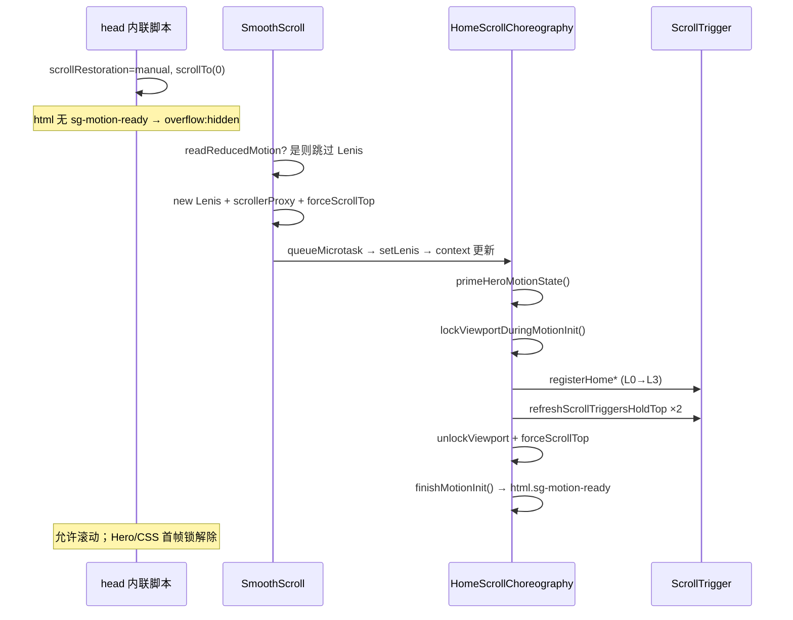

# 规则总览

> **用途**：把全站「什么时候走哪条分支、谁先谁后、什么禁止」串成一张图。细节实现见 [架构](./架构.md)、[动效](./动效.md)、[排障](./排障.md)。  
> **对齐代码**：2026-05-29 · `experiment/shader-field`。

---

## 1. 文档怎么读

| 你想… | 读 |
|--------|-----|
| 改文件 / 路由 / 数据从哪来 | [架构.md](./架构.md) |
| 改色 / 字体 / 品牌图形 | [视觉系统.md](./视觉系统.md) |
| **前端重设计 / Signal 组件 / AI 出稿** | [前端设计协议.md](./前端设计协议.md) |
| 加 GSAP / pin / 变量 | [动效.md](./动效.md) |
| 报错 / 刷新怪现象 | [排障.md](./排障.md) |
| **理清所有 if/先后关系** | **本文** |

---

## 2. 首屏启动时序（正常动效路径）



**硬顺序（违反会出 bug）**

1. **Lenis + `scrollerProxy`** 就绪后，`HomeScrollChoreography` 才注册 ST（`useLenis() !== null`）。
2. **注册 pin 前** `lockViewportDuringMotionInit()`；**双次 refresh 后** 再 `unlock` + `finishMotionInit()`。
3. Hero 字标：**不要**在包住字标的 `h1` 上挂 `data-hero-reveal`（与字符 stagger 双驱动）。

| 阶段 | 标志 / API | 作用 |
|------|------------|------|
| 最早 | `<head>` 内联脚本 | 禁止浏览器恢复旧滚动 |
| GSAP 前 | `primeHeroMotionState()` | 去掉 `sg-motion-ready`，Hero 先藏字 |
| ST refresh | `lockViewportDuringMotionInit` | `body position:fixed`，看不见「滑下去再弹回」 |
| 完成 | `finishMotionInit()` | 加 `sg-motion-ready`，`overflow` 恢复 |

实现文件：`lib/scroll-top-lock.ts`、`lib/sg-motion-init.ts`、`components/smooth-scroll.tsx`、`components/home-scroll-choreography.tsx`。

---

## 3. 总开关：`prefers-reduced-motion`

**探测**：`lib/sg-reduced-motion.ts` → `readReducedMotion()` / `useReducedMotion()`。

| 子系统 | `reduce` = true 时 |
|--------|-------------------|
| Lenis | **不创建**（`SmoothScroll` 直接 return） |
| ScrollTrigger 编排 | **不注册**；`applyReducedMotionStatic()`，`--depth-t: 0` |
| WebGL | **强制 `off`**（`detectSgWebglTier` 首行判断） |
| CSS | `html:not(.sg-motion-ready)` 下 overflow 改回 `auto`，Hero 不藏字 |

用户在浏览中打开「减少动态效果」→ Lenis `destroy` + `setLenis(null)`，需 **整页刷新** 才能重新走完整编排（见排障）。

---

## 4. WebGL 分级

**入口**：`lib/sg-webgl-policy.ts` · 环境变量 `NEXT_PUBLIC_SG_WEBGL`。

| 条件（自上而下） | 结果 |
|------------------|------|
| `prefers-reduced-motion` | `off` |
| 未设 / 非 lite·full | **`off`（默认）** |
| `off` / `0` / `false` | `off` |
| `lite` | `lite` |
| `full` / `on` / `1` / `true` | `full` |

| tier | Hero Canvas | Bloom | `WaterVolumeFx` |
|------|-------------|-------|-----------------|
| `off` | 否 | 否 | 否 |
| `lite` | 是 | 否 | 否 |
| `full` | 是 | 是 | 是 |

**性能守卫**（`SgPerformanceGuards`，与 tier 正交）：

| 条件 | 行为 |
|------|------|
| `document.hidden` | `gsap.ticker.sleep()` + `data-doc-hidden` |
| Hero 可见比例 &lt; 10% | `data-sg-atmosphere-paused` → 水下 JS / 光河动画暂停 |

---

## 5. Lenis ↔ ScrollTrigger

| 规则 | 说明 |
|------|------|
| **唯一创建点** | `SmoothScroll` |
| **唯一首页 ST 挂载** | `HomeScrollChoreography` + `motion/register-*` |
| **代理** | `ScrollTrigger.scrollerProxy(document.documentElement)` ↔ `lenis.animatedScroll` |
| **刷新钉顶** | `refreshScrollTriggersHoldTop(lenis)` = refresh → forceTop → update → forceTop |
| **卸载清理** | `HomeScrollChoreography` cleanup：`mm.revert()` + `ctx.revert()`（**不是** SmoothScroll 全局 kill） |
| **resize** | Lenis `resize` + `refreshScrollTriggersHoldTop`；编排内另 debounce 200ms |
| **字体** | `document.fonts.ready` 且 **距顶 &lt; 120px** 才 refresh（避免深滚用户被拽回顶） |

**锚点导航**（`use-anchor-nav.ts`）：站内 `#` → `lenis.scrollTo(target, { immediate: true, lock: true })`；无 Lenis 则原生 `scrollIntoView`。

---

## 6. 动效硬约束（产品 + 技术）

| 规则 | 原因 |
|------|------|
| 正文区 **禁止** 滚动 scrub `opacity` / `autoAlpha` | 可读性；历史 manifesto 教训 |
| Pin 起点用 **`top 72px`（px）** | 对齐 sticky 顶栏，勿用 vh 魔数 |
| `--depth-t` **只能**经 `formatSafeDepthProgress` → `writeScrollDepth` | 防止非法 CSS 导致整页发灰 |
| B 站预取/可见：**滚动测量** | `IntersectionObserver` 的 `rootMargin` **不支持 vh** |
| 片场可见阈值 | 面积比 ≥ **8%**（`PANEL_VISIBLE_RATIO`） |
| 预取带 | 顶边进入视口 + **0.5× 视口高度** 的下方带（px 算） |
| 微信横滑 | **纯手控**，无竖滚绑 `scrollLeft` 的 ST |
| `fit-reveal` | **仅 mobile**（`&lt; md`）；桌面由 `fit-closing-pin` 接管，避免双注册 |

**注册顺序真值**：`components/motion/sg-home-registry.ts`（与 [动效.md](./动效.md) 表一致）。

---

## 7. 内容与展示规则

### 7.1 触点 `#social`

| 数据 | `lib/social-channels.ts` |
| UI | `components/home-social.tsx` |

`social-channels.ts` 只保存已经上线且可访问的四个渠道：微信、B 站、小红书和 GitHub。不要加入 `href: "#"` 的筹备中入口；渠道正式上线后再写入数据。

Discord：**不在** `social-channels`；入口在 `#call` / `site-contact.ts`。

### 7.2 目录与数量

文章目录由 `lib/wechat-official-feed.ts` 驱动，视频目录由 `lib/surfing-founders-video-season.ts` 驱动。数量只在对应目录中出现；首页不再显示脱离内容的聚合计数。

### 7.3 首页内容线

`components/home-founders.tsx` 只展示三条已经有真实内容支撑的内容线：人物特稿、视频播客、方法论访谈。不要预先展示未上线栏目或待公布席位。

### 7.4 `#fit` 空壳

`HomeFit` 为 **sr-only** 锚点；文案在 `call-join`；桌面 ST `fit-closing-pin` 仍挂 `#fit`。

---

## 8. CSS 首屏状态机

| 状态 | 条件 | 效果 |
|------|------|------|
| 未就绪 | `html:not(.sg-motion-ready)` | `overflow: hidden`；Hero 字标 opacity 0 / reveal 下移 |
| 滚动锁 | `html[data-sg-scroll-lock]` | 同上 overflow（与 body fixed 并用） |
| 就绪 | `html.sg-motion-ready` | 正常滚动与 Hero 动画 |

`prefers-reduced-motion` 媒体查询内：未就绪时 overflow 为 `auto`，不藏 Hero。

---

## 9. 工程与协作门禁

| 层级 | 规则 |
|------|------|
| **CI**（`.github/workflows/ci.yml`） | PR / `main` / `experiment/**` → `npm ci` → `lint` → `build` |
| **提交** | Conventional Commits + `commitlint`（见 `CONTRIBUTING.md`） |
| **本地** | PR 前 `npm run lint` + `npm run build` |
| **Agent** | `AGENTS.md`：Next 16 与训练数据可能不一致，改前查 `node_modules/next/dist/docs/` |
| **环境变量** | `.env.local.example`：`SITE_URL`、`SG_WEBGL`、`GSAP_DEBUG`、`BUILD_TIME` |

---

## 10. 改东西时快速决策

```text
要加滚动动画？
  → reduced? 是 → 不加 ST，考虑静态 CSS
  → 改正文 opacity? → 禁止
  → 新 ST → 放进 register-*，经 sg-home-registry 挂载；勿在 SmoothScroll 里散建

要加 WebGL？
  → reduced? → 不会挂载
  → 默认 off；本地显式 NEXT_PUBLIC_SG_WEBGL=lite|full

要加外链渠道？
  → social-channels.ts 填 href
  → http(s) 才会进视频区；# 占位不会显示

刷新后滚动乱跳？
  → 查排障「刷新时先往下滑」；确认 Lenis 先于 ST、lock/refresh 顺序

B 站不播 / IO 报错？
  → 禁止 vh rootMargin；用 use-founder-panel-visible 滚动测量
```

---

## 11. 文件 → 职责（规则相关）

| 文件 | 规则职责 |
|------|----------|
| `lib/sg-reduced-motion.ts` | 无障碍总闸 |
| `lib/sg-webgl-policy.ts` | WebGL 三档 |
| `lib/scroll-top-lock.ts` | 钉顶 / 视口锁 / ST refresh 包装 |
| `lib/sg-motion-init.ts` | `sg-motion-ready` 生命周期 |
| `components/smooth-scroll.tsx` | Lenis 唯一实例 |
| `components/home-scroll-choreography.tsx` | ST 唯一 React 入口 |
| `components/motion/sg-home-registry.ts` | 注册顺序真值 |
| `lib/social-channels.ts` + `home-social.tsx` | 外链/live 过滤 |
| `lib/use-founder-panel-visible.ts` | 片场可见 / 预取 |
| `app/layout.tsx` | 最早 scrollRestoration + 壳层顺序 |
